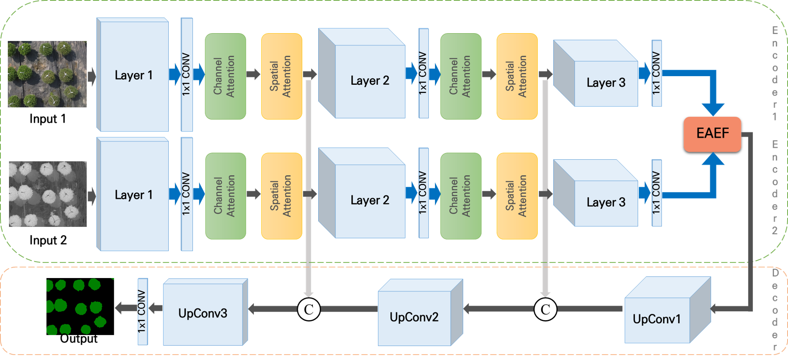
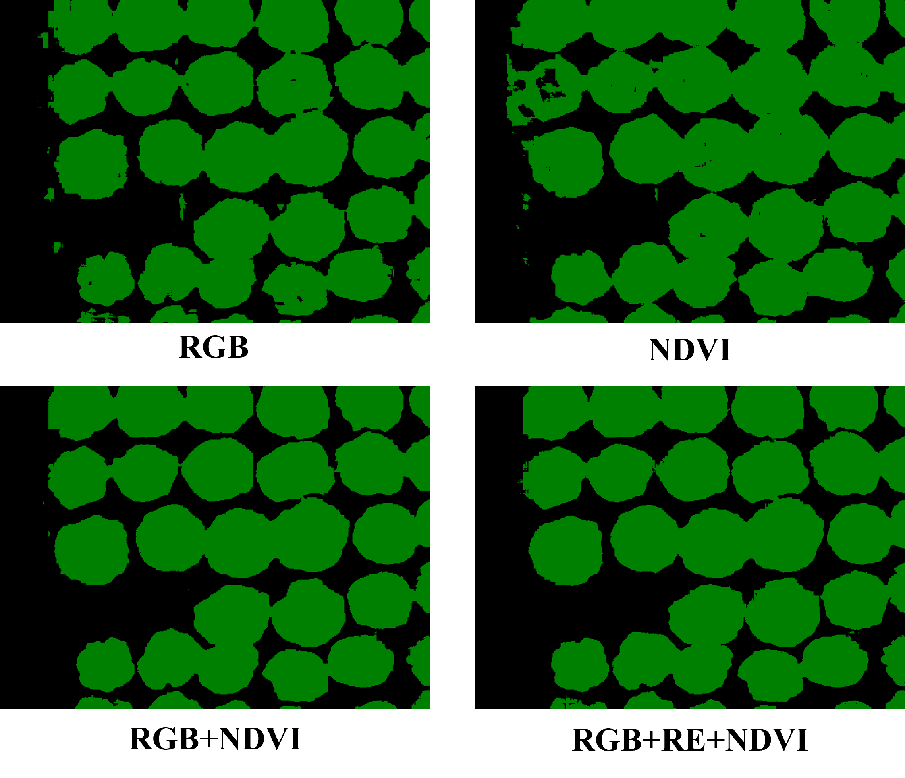

# MSFFNet
Semantic Segmentation of Agricultural Crop Multispectral Image Using Feature Fusion


This repository contains the code for my paper: [Semantic Segmentation of Agricultural Crop Multispectral Image Using Feature Fusion
](https://www.kci.go.kr/kciportal/ci/sereArticleSearch/ciSereArtiView.kci?sereArticleSearchBean.artiId=ART003077667).
<p float="center">
  
</p>


## DATA-DIR
```sh
<dataset>
./rgb                 //rgb images
./etc multispectral   //another multispectral images dic ex) blue, green, nir, re ---
./labels              //.
./train.txt
./test.txt            //Train-test split.
```

## Getting started

This code was tested on `linux` and requires:

* Python 3.8
* conda3 or miniconda3
* CUDA capable GPU (one is enough)

### 1. Setup environment

```shell
conda create --name <your env name> --file environment.yml
```

### 2. Custom dataset
We do not provide custom datasets. sorry.


#### Data Structure
```sh
<DATA-DIR>
./annots                //Natural language annotations where each file consisting of three sentences.
./motions               //Raw motion data standardized as SMPL which is similiar to AMASS.
./motions_processed     //Processed motion data with joint positions and rotations (6D representation) of SMPL 22 joints kinematic structure.
./split                 //Train-val-test split.
```

### 3. Run

## Train


```shell
python train.py
```
The results will be rendered and put in ./runs/


## Inference

```shell
python inference.py
```
The results will be rendered and put in ./result/


### Inference example
<p float="left">
  
</p>
